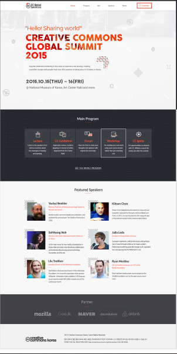

# startup-summit
This project is my first capstone project at Microverse. I will be building a website for the upcoming (fictional) Nigeria's first Entrepreneurship and Startup Management Summit

The goal of this project is to build a simple multi page responsive conference website which will be coming up later this year. The website will show all the necessary information concerning the conference including: the speakers, program of event, sponsors and other relevant information.

In this project, you are expected to setup Html-CSS-Javascript linter following the guidelines stated in the Html-CSS-Javascript linter config documentation, follow mobile first approach while building the website, make the website responsive on mobile and desktop, make website interactive, run tests and finally deploy.

The project will contain the homepage and about page.

## Built With

- HTML5, Javascript
- CSS3
- Linters

## Live Demo

## Getting Started
To get a local copy up and running follow these simple example steps.

## Prerequisites
- Have a good knowledge on how to parse UI designs
- Have VSCode or other text editor installed. [Link to download VSCode](https://code.visualstudio.com/download)
- Install node package. [Link to download node](https://nodejs.org/en/download/)
- Have git installed.[Link to download git](https://git-scm.com/downloads)
- Create a github repository.

## Setup
- git clone https://github.com/kendoriddy/startup-summit.git
- cd startup-summit/
-Follow the HTML-CSS linter configuration to docs to setup linters [Link to Microverse linter docs](https://github.com/vickymarz/linters-config/tree/master/html-css-js)

## Run tests

For tracking linters errors locally, you need to follow these steps:
- For tracking linter errors in HTML file run:
`npx hint .`
- For tracking linter errors in CSS file run:
`npx stylelint "**/*.{css,scss}"`
- For tracking linter errors in Javascript file run:
`npx eslint .`

## Deployment

- Use GitHub pages to deploy website
- For more information about publishing sources, see [About github pages](https://pages.github.com/)

## Author

👤 **Kehinde Ridwan Onifade**

- GitHub: [@githubhandle](https://github.com/kendoriddy)

- LinkedIn: [LinkedIn](https://www.linkedin.com/in/kehindeonifade/)

## 🤝 Contributing

Contributions, issues, and feature requests are welcome!

Feel free to check the [issues page](../../issues/).

## Show your support

Give a ⭐️ if you like this project!

## Acknowledgments

- Design inspiration by [Cindy Shin on Behance](https://www.behance.net/gallery/29845175/CC-Global-Summit-2015)
- Microverse
- Coding Partners
- Code Reviewers

## 📝 License

This project is [MIT](./MIT.md) licensed.